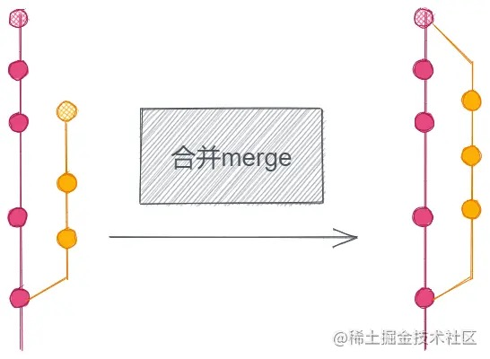
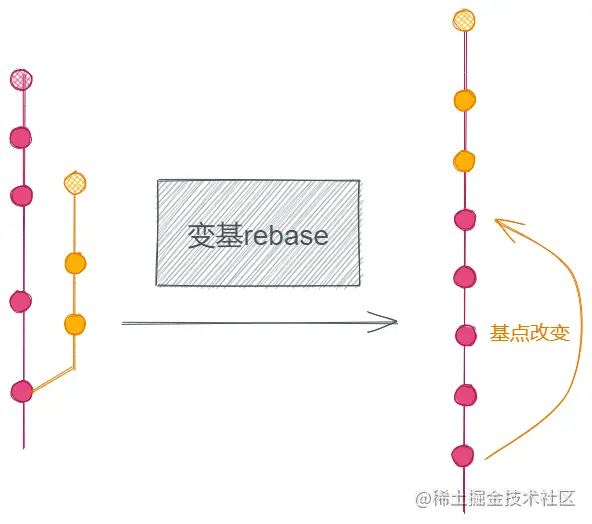
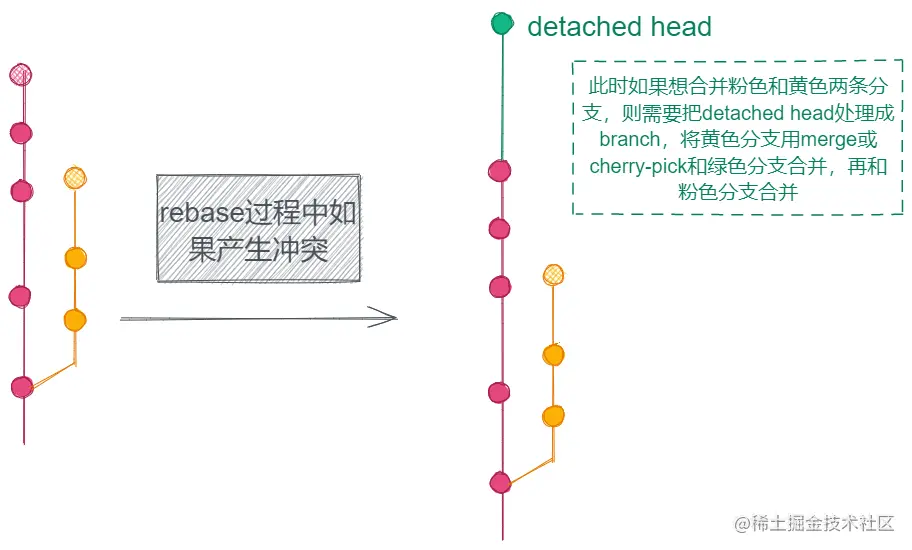

## 合并到master分支
```
git merge master
```
合并master分支可能会产生冲突, 如果产生冲突, 要到IDE手动处理完冲突的文件后, 提交一个merge commit才能完成合并

<!--  -->

## 变基到master分支
```
git rebase master
# 或者
git pull --rebase origin master
```
变基的意思是把工作分支的基点变成master分支的最新commit, 再依次提交原本工作分支上的commit, 使得工作分支的commit历史更清晰明了. 但是要注意远程工作分支的commit历史是不会变基的, 需要本地分支强行push到远程


<!--  -->


## merge和rebase的区别
1. rebase抹去了分支的"合并"这一操作, 使得分支的commit历史是更加线性的. 这也是rebase和merge的最大区别, merge保留了"合并"这一过程
2. rebase更适合feat分支使用, 即用于新增项目功能特性的分支. 因为一旦master和工作分支产生冲突, rebase会直接生成一个detached head, 即当前head指向的工作环境是和之前的分支分离的, 此时如果需要再合并的话会很麻烦, 不如直接使用merge方便.

<!--  -->

