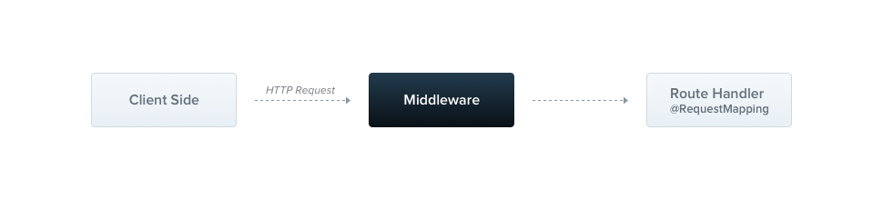
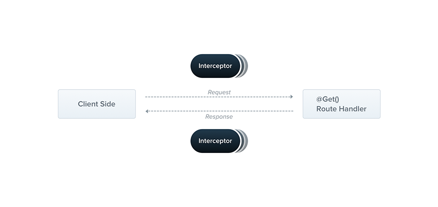
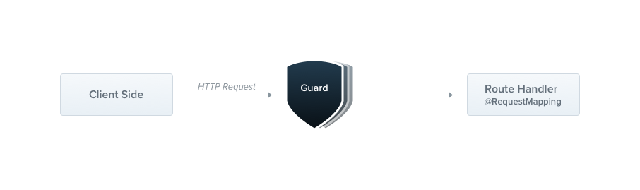

## 1. 初始化项目

```bash
  nest new nest-starter
```

## 2. 添加多环境配置

这里使用`yaml`格式配置文件, 同时安装工具包`lodash`
```bash
pnpm add js-yaml lodash nest-typed-config
pnpm add @types/js-yaml @types/lodash -D
```

通过`nest-typed-config`包可以为配置文件属性添加类型, 便于之后在项目中使用

### 2.1 静态资源目录配置
> nest项目除`ts,js`外的文件并不会拷贝到dist目录中 <br>
> 因此需单独进行配置, 否则项目运行后会找不到文件

nest-cli.json
```json
"compilerOptions": {
  // 每次编译时是否删除dist目录
  "deleteOutDir": true,
  // 是否监听assets文件变化
  "watchAssets": true,
  "assets": [
    {
      "include": "../resources/*.yml",
      "outDir": "./dist/resources"
    }
  ]
}
```

### 2.2 配置文件类型

```typescript
export class ProfileConfig {

  @Allow()
  active?: string
}

export class ApplicationConfig {

  @Allow()
  public message: string

  @Allow()
  @Type(() => ProfileConfig)
  public profile: ProfileConfig

}
```

```yaml
message: hello

profile:
  active: dev
```


## 中间件 Middleware
> 中间件是一个在路由处理之前被调用的函数, 它可以访问`request`和`response`对象 <br>



中间件可以执行一下任务
- 可以添加任意逻辑
- 对request或者response对象进行修改
- 退出 请求-响应 生命周期
- 在堆栈中调用下一个中间件
- 如果当前中间件没有退出 请求-响应 生命周期, 那么必须调用`next()`方法 

## 拦截器 Interceptors
> 拦截器是一个用`@Injectable()`装饰器修饰的类
> 拦截器需要实现`NestInterceptor`接口



拦截器有一系列实用的功能, 这些功能受到面前切面编程(AOP)的启发

通过拦截器可以实现以下功能
- 在方法执行时前后 添加额外的逻辑
- 转化一个函数返回的结果
- 转化一个函数返回的异常
- 扩展方法的功能
- 根据具体条件，完全覆盖一个函数


## 异常过滤器 ExceptionFilter
> 虽然内置


## 守卫  Guard

> 守卫有一个单一的职责. 他们根据运行时的某些条件(如权限, 角色, ACLs等)来决定一个请求是否会被路由处理程序处理. <br>
> 这一过程通常被称作`授权` <br>
> 授权在传统的`Express`应用中通常由中间件`Middleware`来处理 <br>
> 通过中间件来处理授权操作是一个很好的选择, 因为像令牌验证和为请求对象附加属性这样的操作与特定的路由上下文并无紧密的联系 <br>
> 但是中间件, 它不知道在调用`next()`函数后, 哪个处理程序将被执行 <br>
> 而`Guard`可以访问`ExecutionContext`实例, 因此知道下一步将执行什么. <br>
> 守卫的设计就像`异常过滤器` `管道`和`拦截器`, 可以让你在请求/响应周期中的正确位置插入处理逻辑 <br>
> 这有助于让代码更易复用且是可声明的
